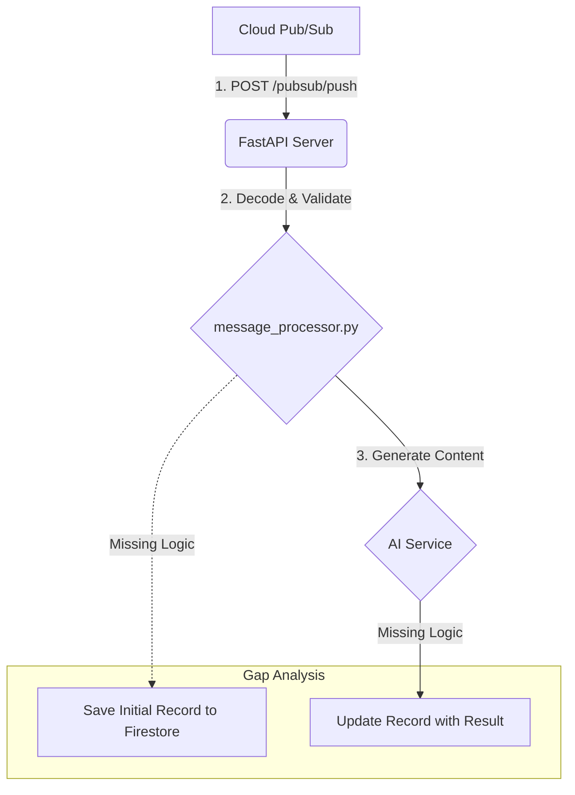

# Python Service Contract Analysis (Current State)

This document outlines the data contracts and processing flow of the new Python `processor-service-py` as it currently stands. It should be compared against `ts-service-contract.md` to identify and bridge any gaps.

## I. Data Flow Overview

The service is designed to replicate the TypeScript service's data flow but is not yet fully implemented.



1.  **Receive Push Notification:** The FastAPI server receives a `POST` request from Google Cloud Pub/Sub.
2.  **Decode and Validate:** The `message_processor.py` controller decodes the Base64-encoded message and validates its structure using Pydantic models.
3.  **Generate Content:** It calls the configured AI service to generate the blog post.
4.  **Missing Logic:** The service **does not yet** create or update a job record in Firestore. This is the most significant deviation from the TypeScript service.

---

## II. Input Contract

The Python service correctly models the incoming data structures using Pydantic, ensuring compatibility with the JSON payloads from the existing system.

### `PubSubMessage` (The Envelope)

This is the Pydantic model for the raw push notification body.

```python
# Location: src/main.py
class PubSubMessage(BaseModel):
    message: dict
    subscription: str
```

### `BlogPostMessage` (The Payload)

After decoding the `data` field, the service validates the payload against this model. It correctly uses `alias` to map JSON `camelCase` fields to Python `snake_case` fields.

```python
# Location: src/controllers/message_processor.py
class BlogPostMessage(BaseModel):
    post_id: str = Field(..., alias='postId')
    action: str
    timestamp: int
    data: BlogPostData

    class Config:
        populate_by_name = True
```

### `BlogPostData` (The Content Details)

This model handles the specific details for the AI content generation.

```python
# Location: src/controllers/message_processor.py
class BlogPostData(BaseModel):
    id: str
    title: Optional[str] = None
    content: str
    keywords: List[str]
    focus: str
    regeneration_instructions: Optional[str] = Field(None, alias='regenerationInstructions')
    # ... and other optional fields
```

---

## III. Output Contract (Firestore Document)

**This is currently not implemented.**

To be a compatible replacement, the Python service must create a Firestore document in the `posts` collection with a structure identical to the `ProcessedBlogPost` interface from the TypeScript service.

### Required `ProcessedBlogPost` Structure

The Python service needs to be updated to create and manage a dictionary/object with the following structure, which will then be saved to Firestore.

```python
# This is the target structure to be implemented
processed_blog_post = {
    # --- Core Fields ---
    "postId": str,
    "action": str,
    "timestamp": int,
    "status": str, # 'processing', 'completed', or 'error'
    
    # --- Data Payload ---
    "blogPost": dict, # The original data payload as a dictionary
    
    # --- Timestamps ---
    "processedAt": str, # ISO 8601 timestamp
    "completedAt": str, # Optional ISO 8601 timestamp
    "errorAt": str, # Optional ISO 8601 timestamp
    
    # --- Result & Error Fields ---
    "generatedPostId": str, # Optional ID
    "error": str, # Optional error message
}
```

## IV. Verification Plan Checkpoints & Gaps

1.  **Input:** ✅ The Python service correctly parses the `PubSubPushMessage` and the `BlogPostMessage` payload. The input contract is met.
2.  **Output:** ❌ **GAP IDENTIFIED:** The service does not create or update the `ProcessedBlogPost` job record in Firestore. This is the primary piece of logic that must be added to achieve compatibility. 