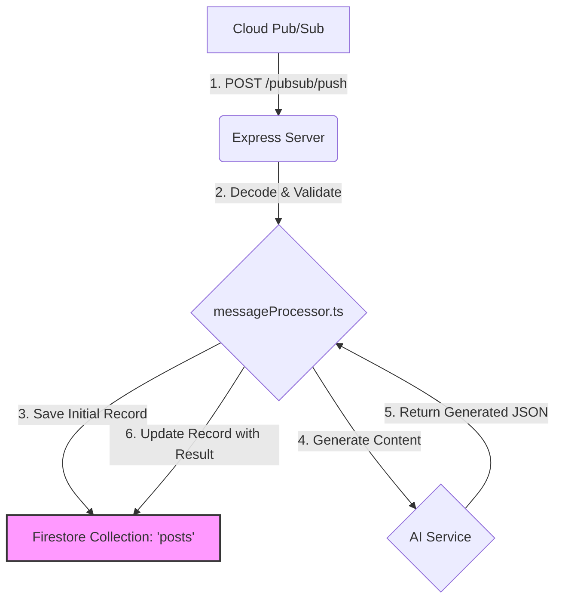

# TypeScript Service Contract Analysis

This document outlines the data contracts and processing flow of the original TypeScript `processor-service`. It serves as a blueprint for ensuring the new Python service is a compatible, drop-in replacement.

## I. Data Flow Overview

The service follows a standard Pub/Sub push notification pattern.



1.  **Receive Push Notification:** The Express server receives a `POST` request from a Google Cloud Pub/Sub subscription.
2.  **Decode and Validate:** The `messageProcessor.ts` controller decodes the Base64-encoded message data and validates its structure.
3.  **Save Initial Record (Output Contract):** It immediately creates a document in the `posts` Firestore collection with a status of `processing`. This document acts as a job record.
4.  **Generate Content:** It calls the AI generation service (e.g., OpenAI) with the post details.
5.  **Return Generated JSON:** The AI service returns a structured JSON object containing the blog post.
6.  **Update Record:** The controller updates the job record in Firestore with the generated content and sets the status to `completed` or `error`.

---

## II. Input Contract

The service expects an incoming request body conforming to the `PubSubPushMessage` interface.

### `PubSubPushMessage` (The Envelope)

This is the raw structure of the push notification from Google Cloud.

```typescript
// Location: src/routes/pubsubPush.ts
interface PubSubPushMessage {
  message: {
    data: string; // Base64 encoded JSON string
    messageId: string;
    publishTime: string;
  };
  subscription: string;
}
```

### `BlogPostMessage` (The Payload)

After decoding the `data` field from the envelope, the service expects the following JSON structure. **This is the primary data model our Python service must be able to parse.**

```typescript
// Location: src/controllers/messageProcessor.ts
interface BlogPostMessage {
  postId: string;
  action: 'created' | 'updated' | 'deleted' | 'regenerate';
  timestamp: number;
  data: BlogPostData;
}
```

### `BlogPostData` (The Content Details)

This nested object contains the specific details needed for the AI to generate the content.

```typescript
// Location: src/controllers/messageProcessor.ts
export interface BlogPostData {
  id: string;
  title?: string;
  content: string;
  keywords: string[];
  focus: string;
  regenerationInstructions?: string;
  // ... and other optional fields
}
```

---

## III. Output Contract (Firestore Document)

The primary output of this service is the document it creates and updates in the Firestore `posts` collection. The new Python service must create a document with an identical structure.

### `ProcessedBlogPost`

```typescript
// Location: src/controllers/messageProcessor.ts
interface ProcessedBlogPost {
  // --- Core Fields ---
  postId: string; // Corresponds to BlogPostMessage.postId
  action: 'created' | 'updated' | 'deleted' | 'regenerate';
  timestamp: number;
  status: 'processing' | 'completed' | 'error';
  
  // --- Data Payload ---
  blogPost: BlogPostData; // The original data payload received
  
  // --- Timestamps ---
  processedAt: string; // ISO 8601 timestamp
  completedAt?: string; // ISO 8601 timestamp, added on completion
  errorAt?: string; // ISO 8601 timestamp, added on error
  
  // --- Result & Error Fields ---
  generatedPostId?: string; // ID of the document in the 'generated_posts' collection
  error?: string; // Error message if status is 'error'

  // ... and other optional metadata fields
}
```

## IV. Verification Plan Checkpoints

To verify compatibility, the Python service must:

1.  **Input:** Correctly parse the `PubSubPushMessage` envelope and the Base64-encoded `BlogPostMessage` payload using Pydantic models.
2.  **Output:** Create and update a Firestore document in the `posts` collection that is structurally identical to the `ProcessedBlogPost` interface shown above. The field names, data types, and enum values (`status`, `action`) must match. 